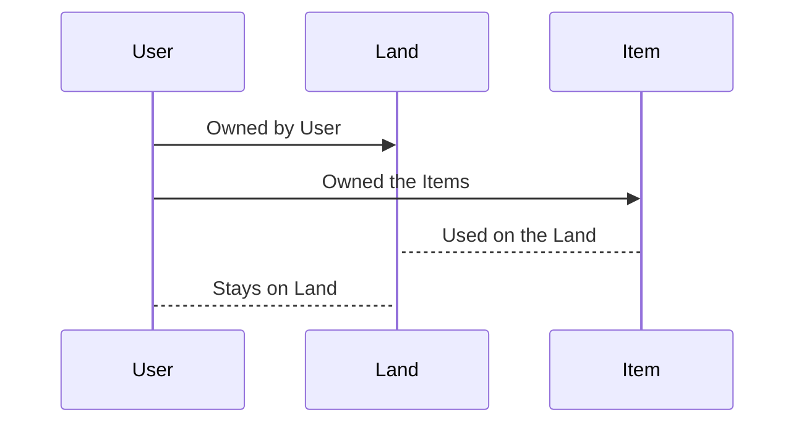

# Hyperland

A **3D Sandbox Game** built on top of SUI utilizing it's fluid **Object** feature i.e "Even fungible is non fungible".


##  Game Info
Hyperland is an open world where anyone can build their own space which is minted as an NFT on Sui devnet and users can purchase items from marketplace to customize their land. Soon after our ZkLogin Integration Web2 users won't even know they are on Web3. Also Parallel gaming with your friends and P2P chatting system is rolling out soon. Stay tuned for that....

We want this game to be fun and easy for anyone to use not just ultra pro max tech guys. So the upcoming features apart from below mentioned one's will mostly roll out on the whole user base thought not just devs. 

> NOTE: To onboard Web2 users login can be kept using Google's OAuth etc but inside many features will be implemented in such a way that they'll encouraged to use wallet and learn Web3. That's the main purpose apart from having relaxation time.

## Hotkeys

|Key| Action |
|-----------|--|
|      1-7     | Cube Switching |
| I | Basic Info
| E | Settings Menu
| Q | Inventory
| B | Items Marketplace

## TODOs
- [x] Open World in Three.Js
- [x] Sui Contract Integration
- [x] Sui Wallet Integration
- [x] Items Marketplace
- [x] Hot keys Integration
- [ ] Contract Improvement
- [ ] [Zk Login](https://github.com/hawkeye0803/Hyperland/issues/1)* for web2 Users
	- [ ] Google
	- [ ] Facebook
	- [ ] Twitch
- [ ] Avatar Selection
- [ ] Multiple Lands
- [ ] Deployment on Mainnet
- [ ] Parallel Gaming
- [ ] Peer 2 Peer chatting
- [ ] Global Chat
- [ ] Land customization
- [ ] Land Marketplace


##  Local host and Deployment

Checkout the website https://hyperland-pi.vercel.app

To install dependencies, run:

 ``` Yarn install ```
 
To launch Hyperland,  run:
```Yarn start ```

Open [http://localhost:3000](http://localhost:3000) to play it in your browser.


## Initial Thought Process





